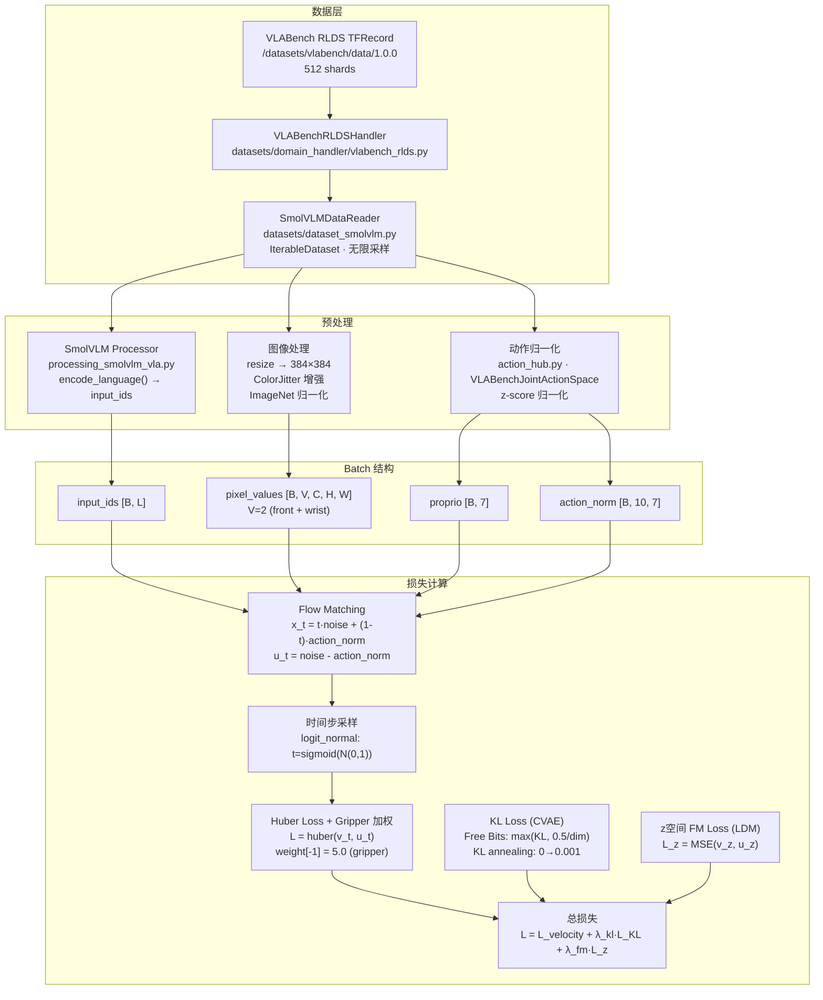
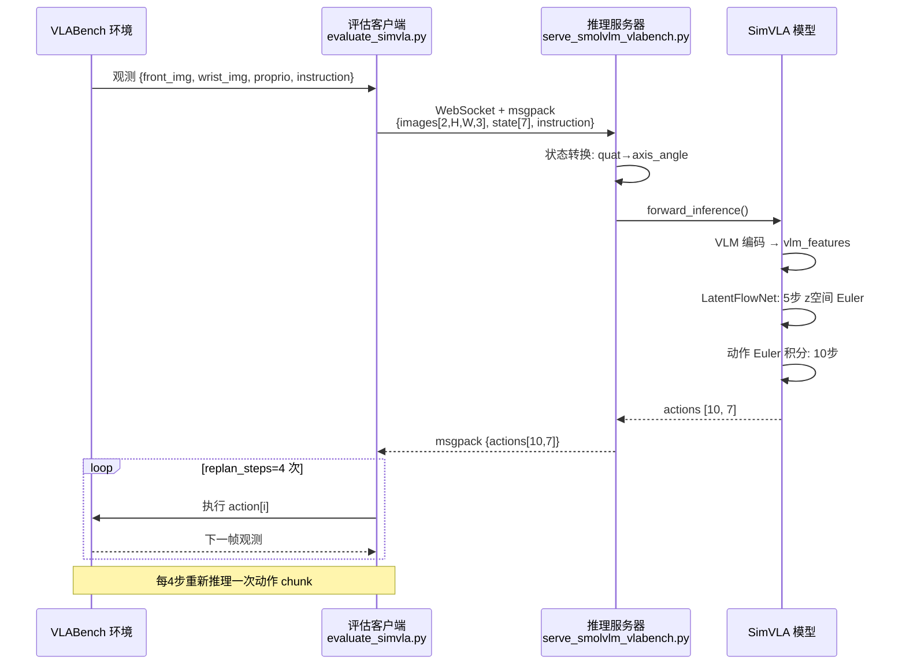

# SimVLA 架构图

## 图1：训练数据流



---

## 图2：模型架构（完整模型）

```mermaid
flowchart TD
    subgraph INPUT["输入"]
        I1["front 图像\n[B, 3, 384, 384]"]
        I2["wrist 图像\n[B, 3, 384, 384]"]
        I3["语言指令\ninput_ids [B, L]"]
        I4["本体感知 proprio\n[B, 7]"]
        I5["噪声 ε ~ N(0,I)\n[B, 10, 7]"]
        I6["时间步 t ∈ (0,1)"]
    end

    subgraph VLM["SmolVLM 骨干 (冻结→微调)"]
        SIGLIP["SigLIP 视觉编码器\n图像 → patch embeddings"]
        CONN["Connector (MLP)\npatch embeddings → VLM 空间"]
        LM["SmolLM2 语言模型\n[image_patches, text_tokens] → hidden states"]
        VF["vlm_features\n[B, seq_len, 576]"]
        VP["vlm_pooled\n[B, 576] (mean pool)"]
    end

    subgraph CVAE["SubgoalVAE (训练/推理分支)"]
        POST["后验 Encoder q(z|vlm,action)\n训练时: vlm_pooled + action_chunk → μ,σ"]
        PRIOR["先验 Encoder p(z|vlm)\n推理时: vlm_pooled → μ,σ"]
        SAMPLE["重参数化采样\nz_goal = μ + σ·ε, z∈R^64"]
        ZPROJ["SubgoalProj\nLinear(64→hidden_size)"]
    end

    subgraph LDM["LatentFlowNet (推理时替换先验采样)"]
        ZNOISE["z噪声 ~ N(0,I)\n[B, 64]"]
        ZEULER["z空间 Euler 积分\n5步 · 条件: vlm_pooled"]
        ZOUT["z_goal [B, 64]"]
    end

    subgraph COND["条件向量 c"]
        TE["时间步嵌入\ntimestep_embedding(t, hidden_size)"]
        PE["本体感知嵌入\nLinear(7→hidden_size)"]
        CCAT["c = time_emb + vlm_pool_proj + proprio_emb + subgoal_proj(z)"]
    end

    subgraph TRANSFORMER["SmolVLMActionTransformer (AdaLN + CrossAttn)"]
        AT["动作 Token 嵌入\n[B, 10, hidden_size=768]"]
        D1["DiTBlockWithCrossAttn × 12\n① AdaLN Self-Attention\n② AdaLN MLP\n③ Cross-Attention → vlm_features"]
        FL["FinalLayer\nAdaLN → Linear(hidden_size→7)"]
        VT["预测速度场 v_t\n[B, 10, 7]"]
    end

    subgraph INFER["推理：Euler 积分 (10步)"]
        X0["x_T = ε ~ N(0,I)"]
        EULER["x_{t-Δt} = x_t - Δt · v_θ(x_t, t, c)"]
        XOUT["动作序列 [B, 10, 7]"]
        DENORM["反归一化\nVLABenchJointActionSpace.denormalize()"]
        ACT["机器人动作\nxyz(3) + axis_angle(3) + gripper(1)"]
    end

    I1 & I2 --> SIGLIP --> CONN --> LM
    I3 --> LM
    LM --> VF & VP

    VP --> POST & PRIOR
    I4 --> POST
    POST -->|训练| SAMPLE
    PRIOR -->|推理(无LDM)| SAMPLE
    ZNOISE --> ZEULER
    VP --> ZEULER
    ZEULER --> ZOUT -->|推理(有LDM)| SAMPLE
    SAMPLE --> ZPROJ

    I6 --> TE
    I4 --> PE
    VP --> CCAT
    TE & PE & ZPROJ --> CCAT

    I5 --> AT
    CCAT --> D1
    VF --> D1
    AT --> D1 --> FL --> VT

    VT -->|训练| HLOSS2["Huber Loss\n对比目标 u_t = ε - action"]
    X0 --> EULER
    CCAT --> EULER
    VF --> EULER
    EULER --> XOUT --> DENORM --> ACT
```

---

## 图3：推理服务流程



---

## 图4：消融实验对比

```mermaid
graph LR
    subgraph B["Baseline\ntrain_smolvlm_vlabench.sh"]
        B1["Concat 模式\n动作token + VLM特征拼接"]
        B2["MSE Loss"]
        B3["Beta(1.5,1) 时间步"]
    end

    subgraph C["Ablation-CVAE\n--use_adaln --use_subgoal_vae"]
        C1["AdaLN/DiT 模式\n+ CrossAttn"]
        C2["Huber Loss\n+ Gripper×5"]
        C3["Logit-Normal 时间步"]
        C4["SubgoalVAE\nz∈R^64"]
    end

    subgraph F["完整模型\ntrain_smolvlm_subgoal.sh"]
        F1["AdaLN + CrossAttn"]
        F2["Huber + Gripper×5"]
        F3["Logit-Normal"]
        F4["SubgoalVAE"]
        F5["LatentFlowNet\nz空间双层扩散"]
    end

    B -->|+AdaLN +CrossAttn\n+Huber +CVAE| C
    C -->|+LatentFlowNet| F
```


